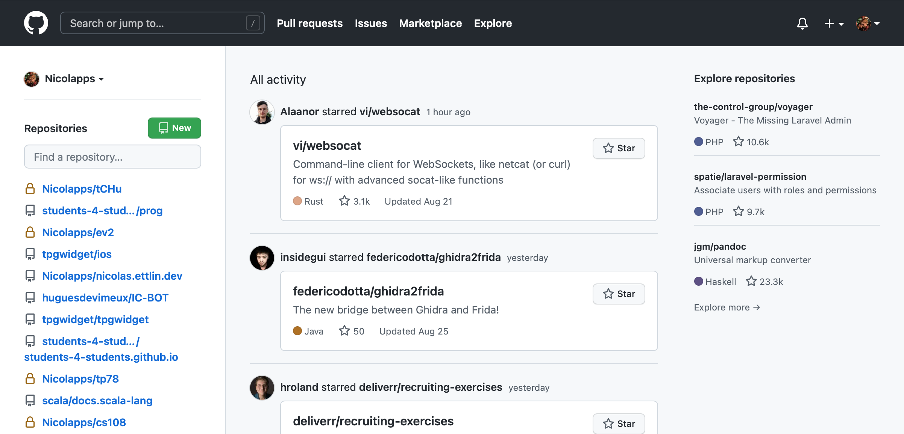
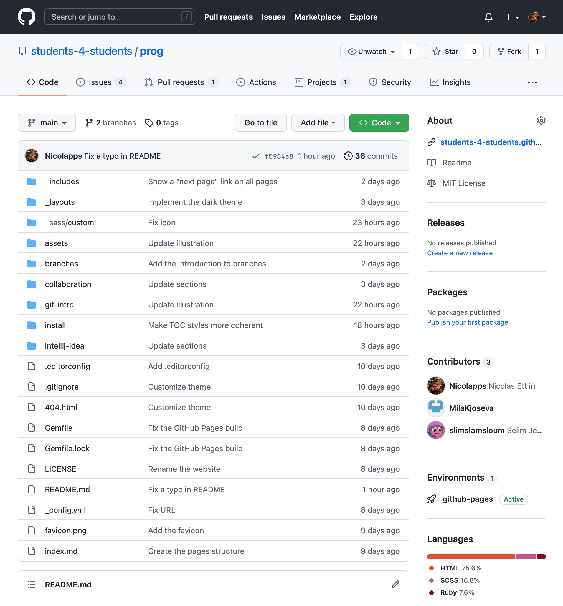
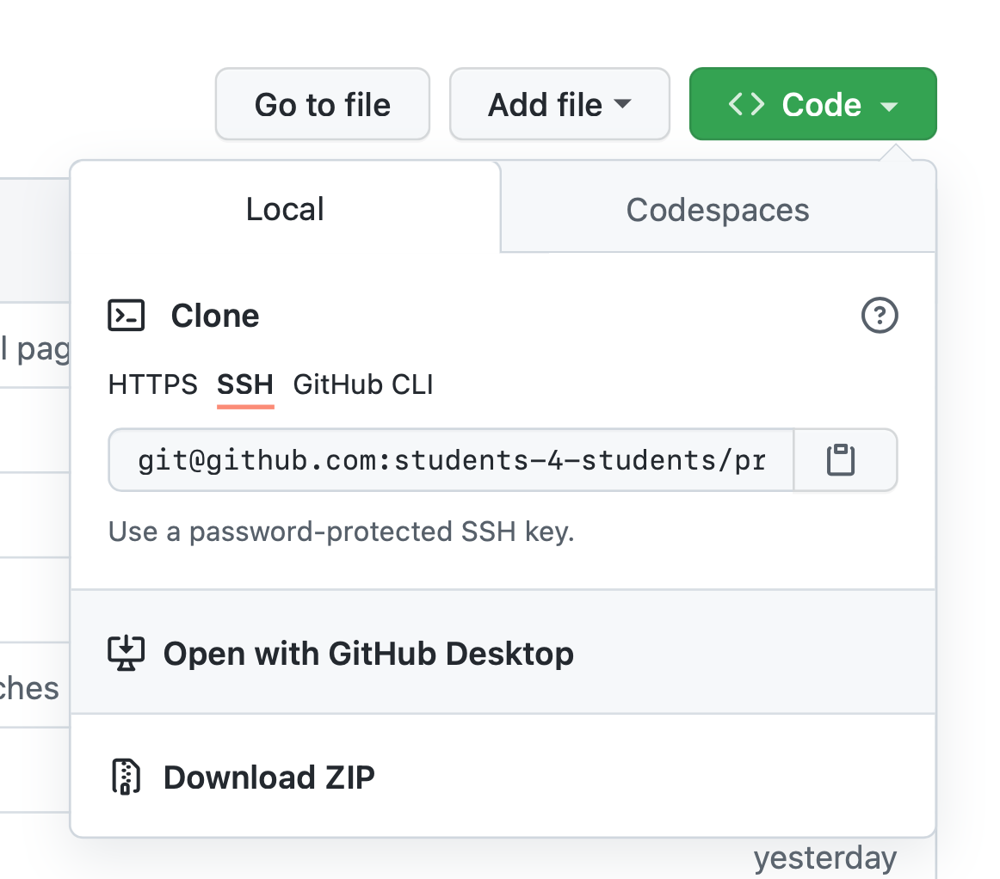

# Découverte de GitHub
{: .no_toc }

Dans cette partie, nous allons jeter rapidement un œil aux fonctionnalités les plus importantes de GitHub.

## Table des matières
{: .no_toc.text-delta }
1. TOC
{:toc}

## Page d’accueil
Il s’agit de la page qui s’affiche lorsque tu te connectes avec ton compte sur <a href="https://github.com" target="_blank">github.com</a>. Sur la gauche, tu retrouves la liste des dépôts sur lesquels tu travailles.

En haut à droite, tu retrouves trois menus essentiels :

* les **notifications**, où tu retrouveras les dernières modifications importants des dépôts que tu suis ;
* le **menu *Nouveau***, qui te permet entre autres de créer un nouveau dépôt ;
* et le **menu *Profil***, qui te permet d’accéder à ton profil et tes réglages.

## Page de dépôt
Rends-toi maintenant sur une page de dépôt. Si tu n’en a pas une sous la main actuellement, tu peux utiliser le <a href="https://github.com/students-4-students/prog" target="_blank">dépôt qui contient ce site</a>.

En haut de la page se trouvent plusieurs onglets contenant des fonctionnalités du dépôt, dont les *pull requests* dont nous parlerons [plus tard](pull-request).

Plus bas, tu retrouves les fichiers stockés dans le dépôt. Par défaut, c’est la branche principale qui s’affiche, mais tu peux voir le contenu d’une autre branche avec le sélecteur en haut à gauche.

### Créer un *fork*
Le bouton ***Fork*** en haut à droite pourra t’être utile si tu veux contribuer à des projets dans lesquels tu n’as pas les droits de modification. Il crée une copie du dépôt (appelée *fork*) sur ton propre compte, sur laquelle tu auras tout les droits.

### Cloner un dépôt
**Cloner un dépôt** consiste à télécharger un dépôt hébergé sur un serveur distant et son contenu, par exemple pour travailler dessus sur son ordinateur.

Tu peux cloner un dépôt en cliquant sur le bouton vert **Code** en haut à droite. Ensuite, clique simplement sur le bouton *Open with GitHub Desktop*. Tu peux ensuite spécifier à quel emplacement le projet doit être cloné, puis tu n’auras plus qu’à confirmer avec le bouton *Clone* de la fenêtre modale qui s’affiche.

  <header>Note</header>
  
Tu auras peut-être remarqué que GitHub propose aussi un bouton <em>Download ZIP</em>. Cependant, ce téléchargement ne comprend que les fichiers stockés dans le dépôt, mais pas les autres informations du dépôt lui-même (comme par exemple l’historique des commits). C’est donc plus pratique de faire un vrai clone dans la plupart des cas.

  <header>Astuce</header>

  
Il est également possible de cloner des dépôts stockés sur un autre service depuis GitHub Desktop, en allant dans le menu <em>File</em> puis <em>Clone Repository…</em>. Sélectionne ensuite l’onglet <em>URL</em>, puis copie dans le premier champ de texte l’URL du dépôt.

  

